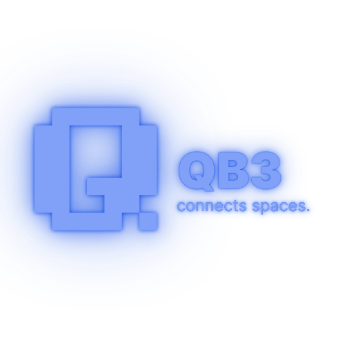

<!-- markdownlint-disable MD033 MD041 -->

  

# QB3 - DePIN pour la logistique du dernier kilomètre

## 🧱 Objectifs Pédagogiques (POC)

Ce projet vise à valider les compétences suivantes :

- **C1** : Rédaction d’un cahier des charges
- **C2** : Développement de smart contracts (Solidity)
- **C3** : Exploitation de jetons ERC-20 & ERC-721
- **C4** : Analyse de sécurité des smart contracts
- **C5** : Mise en place d’une CI (GitHub Actions)
- **C6** : Tests fonctionnels des smart contracts
- **C7** : Développement web (Next.js + Tailwind)
- **C8** : Déploiement sur une blockchain

---

## ⚙️ Stack Technique

- **Smart contracts** : Solidity + Hardhat
- **Frontend** : Next.js 15 + Tailwind CSS
- **Web3** : wagmi + viem + RainbowKit
- **CI** : GitHub Actions
- **Déploiement** : (à compléter selon testnet)

---

## 📁 Structure des smart contracts

- `contracts/QB3Token.sol`
- `contracts/SpaceRegistry.sol`

---
